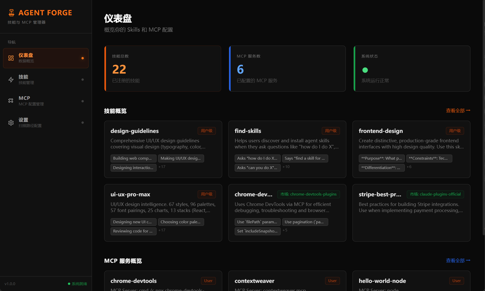
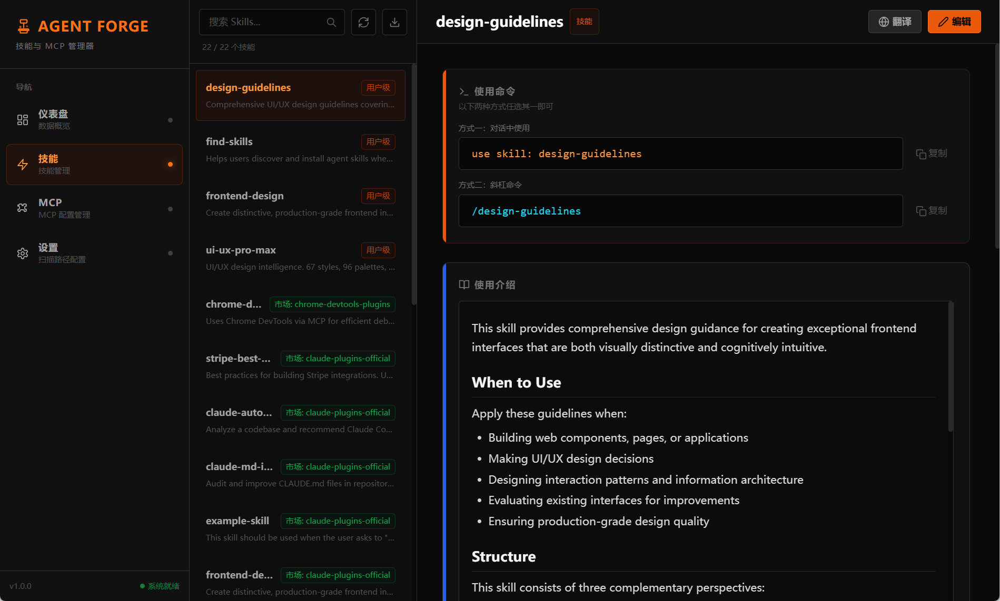
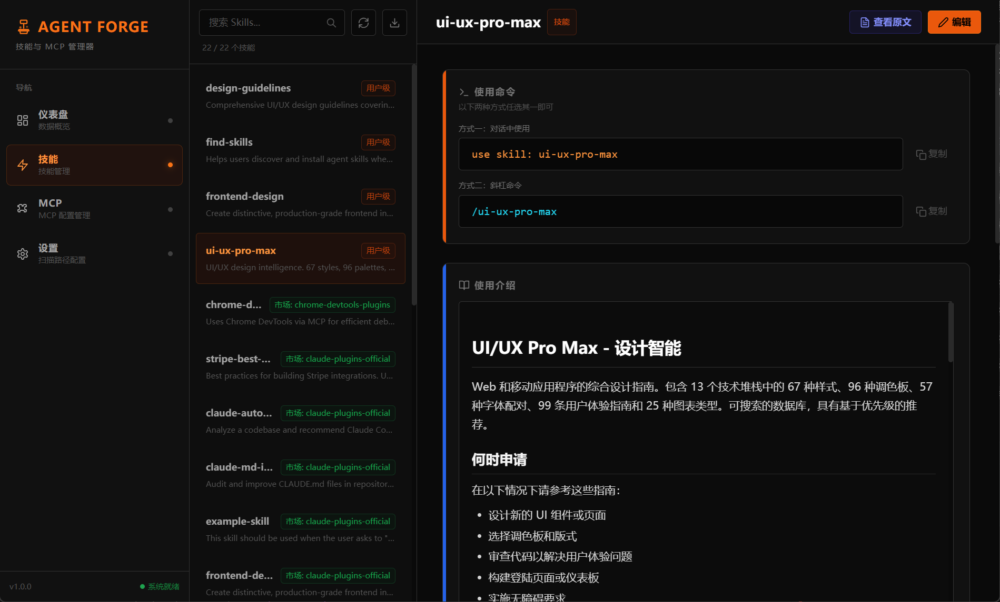
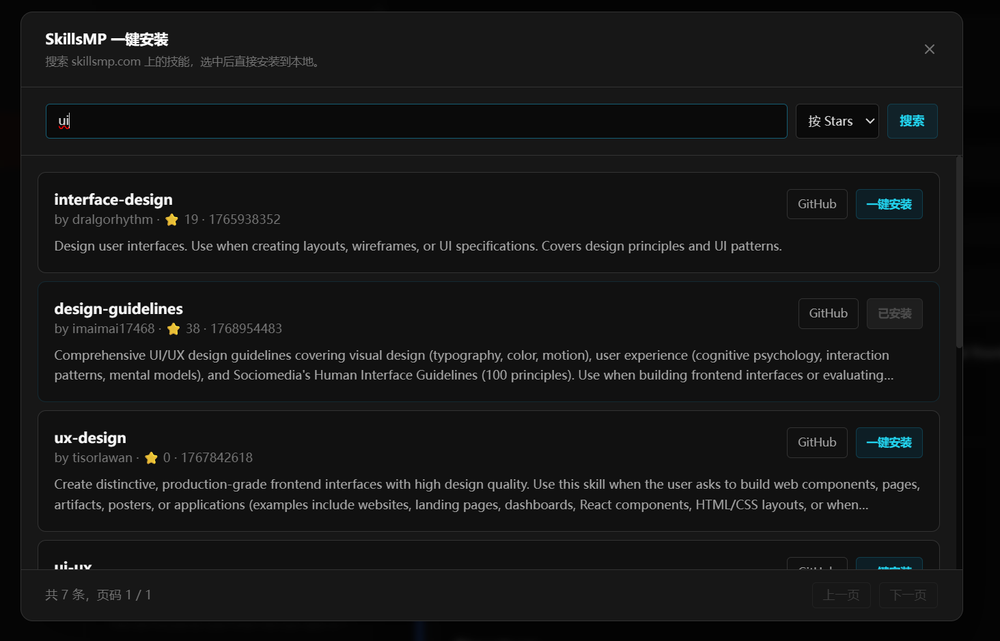
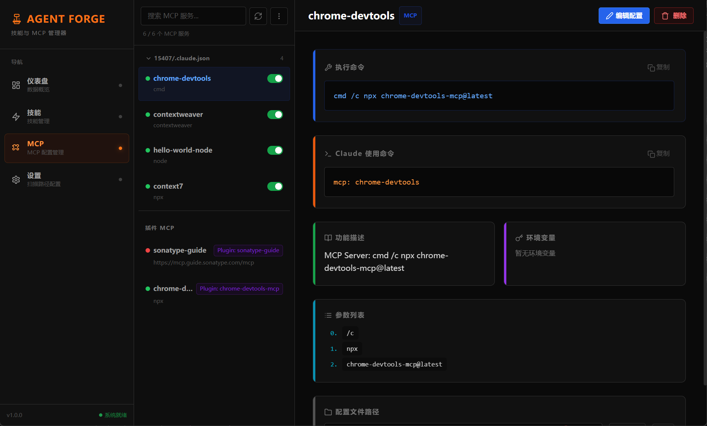
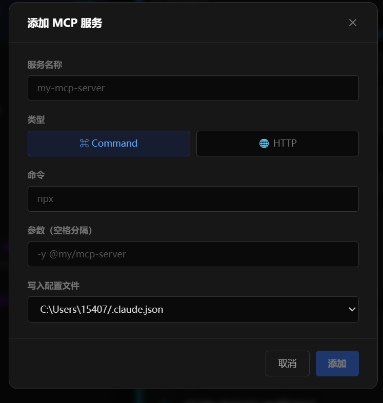
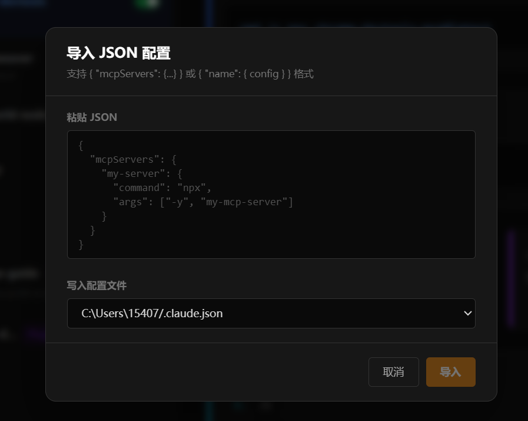
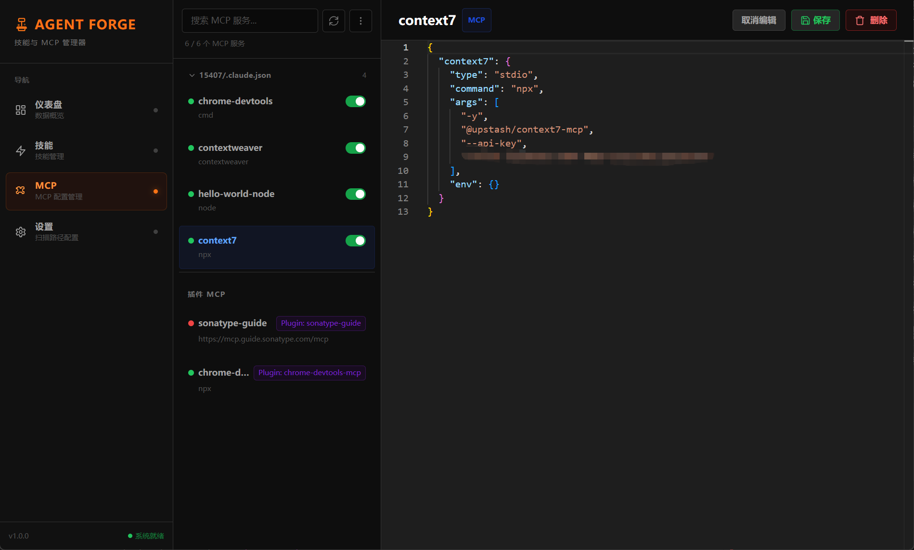
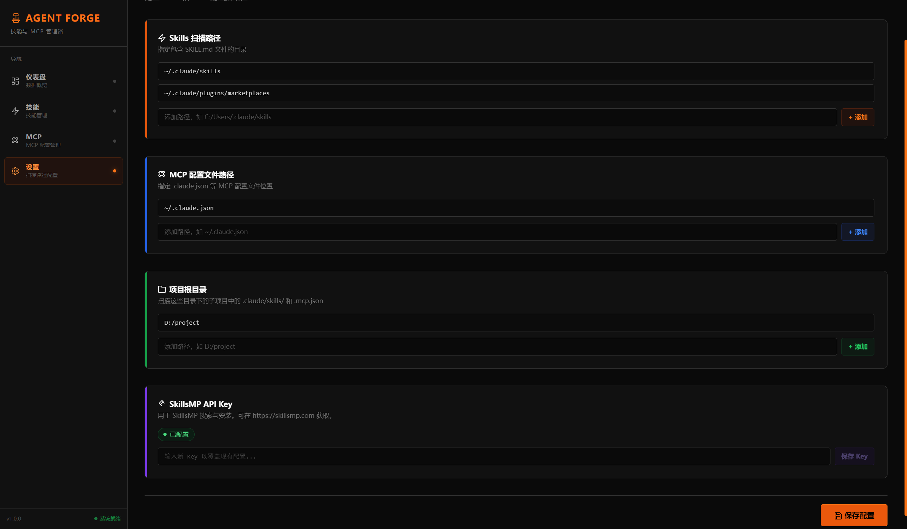

# Agent Forge ⚒️

> **Claude Code Skills & MCP 可视化管理工具**

<p align="center">
  
</p>

Agent Forge 是一款专为 **Claude Code** 用户打造的桌面工具，将分散在各个目录中的 **Skills（技能）** 和 **MCP（Model Context Protocol）** 配置集中到一个优雅的可视化界面，告别手动翻找目录和编辑 JSON 的烦恼。

---

## 解决了什么问题？

使用 Claude Code 时，Skills 和 MCP 配置散落在多个目录，管理非常不便：

- 📂 Skills 文件（SKILL.md）分散在 `~/.claude/skills/`、项目 `.claude/skills/`、插件市场缓存等多处
- 📝 MCP 配置（JSON）分布在 `~/.claude.json`、项目 `.mcp.json` 等不同层级
- 🔍 难以快速查看某个 Skill 的功能说明和使用命令
- ✏️ 编辑配置需要手动定位路径、切换编辑器
- 🛒 发现和安装新技能需要手动从 GitHub 下载

**Agent Forge 将这些操作集中到一个统一的可视化界面。**

---

## 功能截图

### 📊 仪表盘

概览所有技能和 MCP 服务，点击卡片可直接跳转到对应详情。

<p align="center">
  
</p>

---

### 🎯 Skills 管理

自动扫描用户级、项目级、插件市场的所有 SKILL.md 文件，内置 Monaco Editor 支持在线编辑。

<p align="center">
  
</p>

**核心能力：**

- 左侧列表按来源（用户级 / 市场级）分类展示，支持实时搜索
- 右侧详情页显示使用命令（对话命令 `use skill: xxx` + 斜杠命令 `/xxx`），一键复制
- 内置 Monaco Editor，支持语法高亮，直接在应用内编辑 SKILL.md 并保存

---

### 🌐 技能翻译

英文 Skill 一键翻译为中文，方便理解和使用。

<p align="center">
  
</p>

---

### 🛒 SkillsMP 技能市场

接入 [SkillsMP.com](https://skillsmp.com) 技能市场，搜索并一键安装社区技能。

<p align="center">
  
</p>

**功能亮点：**

- 关键词搜索 / AI 语义搜索，智能匹配需求
- 按 Stars / 最近更新排序，支持翻页
- 已安装的技能显示「已安装」标记，不重复安装
- 一键从 GitHub 自动下载 SKILL.md 至本地配置目录

---

### 🔌 MCP 配置管理

可视化管理所有 MCP Server，实时连接状态监控。

<p align="center">
  
</p>

**核心能力：**

- **多源扫描** — 自动识别 `.claude.json`、`.mcp.json`、插件缓存中的所有 MCP 服务
- **健康检测** — 实时显示绿色/红色连接状态指示灯
- **一键启停** — Toggle 开关直接启用/禁用服务，无需手动编辑 JSON
- **单服务编辑** — 编辑时只显示选中服务的 JSON 片段，防止误改其他配置
- **服务详情** — 显示执行命令、Claude 使用命令、参数列表、环境变量、配置文件路径
- **Allowed Tools** — 为每个 MCP Server 配置可用工具白名单
- **操作日志** — 完整记录所有管理操作历史

#### 添加 MCP 服务

通过表单快速添加 Command 或 HTTP 类型的 MCP Server，并指定写入的配置文件。

<p align="center">
  
</p>

#### 导入 JSON 配置

粘贴 JSON 批量导入，支持 `{ "mcpServers": {...} }` 和 `{ "name": { config } }` 两种格式。

<p align="center">
  
</p>

#### 在线编辑配置

内置 Monaco Editor，直接编辑选中服务的 JSON 配置，仅显示该服务的 JSON 片段，避免误操作整个配置文件。

<p align="center">
  
</p>

---

### ⚙️ 设置

自由配置扫描路径和 API Key，支持多路径管理。

<p align="center">
  
</p>

**可配置项：**

- **Skills 扫描路径** — 告诉 Agent Forge 去哪些目录查找 SKILL.md 文件
- **MCP 配置文件路径** — 指定 `.claude.json` 或 `.mcp.json` 的位置
- **项目根目录** — 扫描项目子目录中的 `.claude/skills/` 和 `.mcp.json`
- **SkillsMP API Key** — 用于 SkillsMP 搜索与安装，仅存储在主进程，不暴露到前端

## 快速开始

### 环境要求

- Node.js >= 18
- npm >= 9

### 安装 & 运行

```bash
# 安装依赖
npm install

# 开发模式（热重载）
npm run dev

# 生产预览
npm run start
```

### 构建安装包

```bash
# Windows
npm run build:win

# macOS
npm run build:mac

# Linux
npm run build:linux
```

---

## macOS 安装说明

> ⚠️ 由于应用尚未进行 Apple 签名和公证，macOS 用户首次打开时可能会遇到 **"无法打开"** 或 **"版本不适配"** 的提示。这是 macOS Gatekeeper 安全机制的正常行为，**不影响应用的正常使用**。

### 解决方法

**方法一：临时自签名（推荐）**

安装完成后，打开终端执行：

```bash
sudo codesign --force --deep --sign - /Applications/agent-forge.app
```

该命令会对应用进行本地签名，使 macOS 信任该应用。执行后双击即可正常打开。

**方法二：移除隔离标记**

```bash
xattr -cr /Applications/agent-forge.app
```

**方法三：系统设置**

1. 双击应用，出现无法打开的提示后点击「好」
2. 打开 **系统设置 → 隐私与安全性**
3. 页面底部会出现被阻止的应用信息，点击 **「仍然打开」**
4. 在弹出的确认对话框中点击 **「打开」**

**方法四：右键打开**

右键点击应用 → 选择 **「打开」** → 在弹出的对话框中点击 **「打开」**

---

## 技术栈

| 层级     | 技术                                 |
| -------- | ------------------------------------ |
| 框架     | Electron + electron-vite             |
| 前端     | Vue 3 (Composition API) + TypeScript |
| 样式     | Tailwind CSS                         |
| 编辑器   | Monaco Editor (vue-monaco-editor)    |
| Markdown | marked + DOMPurify                   |
| 代码规范 | ESLint + Prettier                    |

---

## 项目结构

```
Agent-Forge/
├── src/
│   ├── main/                    # Electron 主进程
│   │   ├── index.ts             # 入口 & IPC 注册 & 安全校验
│   │   └── services/            # 业务服务层
│   │       ├── skillsService.ts           # Skills 扫描/读写
│   │       ├── skillsMarketplaceService.ts # SkillsMP 市场 API
│   │       ├── mcpService.ts              # MCP 配置管理 & 健康检测
│   │       ├── mcpLogService.ts           # MCP 操作日志
│   │       ├── dxtService.ts              # DXT 扩展解析/安装
│   │       └── translateService.ts        # 翻译服务
│   ├── preload/                 # 预加载脚本（安全桥接 API）
│   └── renderer/                # 渲染进程（Vue 前端）
│       └── src/
│           ├── App.vue          # 路由调度
│           └── components/
│               ├── DashboardView.vue    # 仪表盘
│               ├── SkillsPanel.vue      # Skills 管理面板
│               ├── McpPanel.vue         # MCP 管理主面板
│               ├── SettingsPanel.vue    # 设置面板
│               └── mcp/                 # MCP 子组件
│                   ├── useMcpPanel.ts   # 状态 & 逻辑（Composable）
│                   └── McpServerList.vue
├── docs/screenshots/            # README 截图
└── electron-builder.yml
```

---

## 安全设计

- **沙箱隔离** — 渲染进程运行在 `sandbox: true` + `contextIsolation: true` 环境
- **路径白名单** — 所有文件读写均通过路径白名单校验，防止路径穿越
- **协议限制** — 外部链接仅允许 `http:` / `https:` 协议
- **DXT 审批流** — DXT 文件必须通过文件对话框选择后才能解析/安装
- **输入净化** — 所有用户输入经过 sanitize 处理，防止配置注入
- **API Key 隔离** — SkillsMP API Key 仅存储在主进程，渲染层只获得「已配置」布尔值

---

## 许可证

MIT
